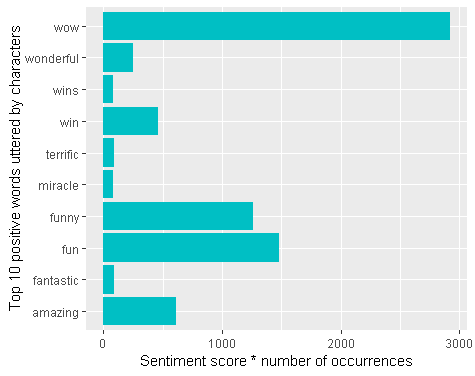

```{r setup, include=FALSE}
knitr::opts_chunk$set(echo = TRUE)
```


&nbsp;
&nbsp;


## The One With All The Sentiment Analysis

&nbsp;

 

&nbsp;


FRIENDS is a very popular American television sitcom, it wouldn't be much of a stretch to say that it was one of the cultural artefacts that defined the 90's for a lot of us. It has been 15 years since the show went off air, but FRIENDS still enjoys a considerable fan following even today. Perhaps this is because it is a very feel-good show - something you can watch when you in the mood for something lighthearted.

In this project, I examine the dialogues across all 10 seasons of FRIENDS, in order to better understand the "mood" of the show and the popular sentiments expressed throughout. I am also interested in the attitudes of the lead characters of the show towards gender and sexuality - in conversations with other friends, we have often talked about how politically incorrect this sitcom could be - for instance,  Chandler Bing's open disgust of his gender non-conforming cross-dressing father, and other plots building on what is masculinity (and femininity). I thus examine the adjectives used to describe men and women in the sitcom. This is a preliminary analysis with plenty of scope for more interesting results in the future, so please do write to me if you have suggestions for future analysis.

I obtained the dataset containing all the dialogues from all seasons of FRIENDS from [Giora Simchoni's comprehensive analysis of the lead characters on FRIENDS](http://giorasimchoni.com/2017/06/04/2017-06-04-the-one-with-friends/). The dataset contains transcripts from 10 seasons, each season having around 24 episodes on average. The aggregate dataset contains 60,817 lines of dialogue, of which the most lines are spoken by the character Rachel Green (9192 lines), followed by Ross Geller (9072 lines). 

&nbsp;
&nbsp;

#### Analysis of the most popular words from the sitcom

I first unnest each line of dialogue into tokens so as to analyze sentiment by word. Then I filter out the stop words (for example "the","an" and so on) and perform a sentiment analysis with the AFINN lexicon on the filtered words. The [AFINN lexicon](https://darenr.github.io/afinn/) rates words for valence with a score ranging from -5 (most negative) to +5 (most positive) - this providing a more nuanced insight into word sentiment than other lexicons. The below graph displays the most popular words from the sitcom by the word sentiment multiplied by frequency.

 
 
&nbsp;

I also examine the most popular words by sentiment - positive and negative - uttered throughout the sitcom - popularity here is measured by the frequency of occurences of the particular word. This is demonstrated in the following two graphs.
 
  

&nbsp;

This seems to lend credence to the theory that FRIENDS is a "feel-good" show - the most popular words with a positive sentiment are "wow", "wonderful" and "win(s)". On the other hand, the most popular words of a negative sentiment are "hell", "ass" and "bitch".
 

  

&nbsp;
&nbsp;


#### The boys are bad and the girls are beautiful

One of the things I am interested in examining is this sitcom's attitudes towards gender and sexuality. FRIENDS has had a significant cultural impact - for one, in terms of its emphasis on [independence among the youth](http://www.buffalo.edu/news/releases/2004/04/6680.html). At the same time, the sitcom has been called out for its [problematic content](https://www.independent.co.uk/arts-entertainment/films/friends-netflix-sitcom-problem-sexism-men-joey-phoebe-chandler-ross-rachel-a8168976.html) - for instance, the time when one of the main characters did not approve of his son playing with a Barbie doll, and blamed it on the influence of his lesbian ex-wife. In this analysis, I examine the way gender is described throughout the sitcom - for instance: a --- man or a --- female. To do this, I unnest the dataset into bigrams and filter the ones where the second word either refers to the masculine gender (man/men/male/boy(s)/guy(s)) or the feminine gender (woman/women/female/girl(s)). I then plot the most popular adjectives preceding the gender reference, as demonstrated in the graph below. 

  

&nbsp;

The most popular reference among the masculine gender is that of the "naked guy", a recurring trope in the show. The second most popular adjective is that of the "bad" boy. For the feminine gender, the most popular adjective used to describe them is "beautiful", followed by "hot". Among the adjectives with a more negative connotation, men in the show are described to be "stupid" or "crazy", while the women are described as "noisy" or "annoying".

There is a lot more interesting analysis to be done on the show - examining attitudes towards race and LGBT communities for one. If there's an idea you think is worth exploring, I'd love to hear more about it.